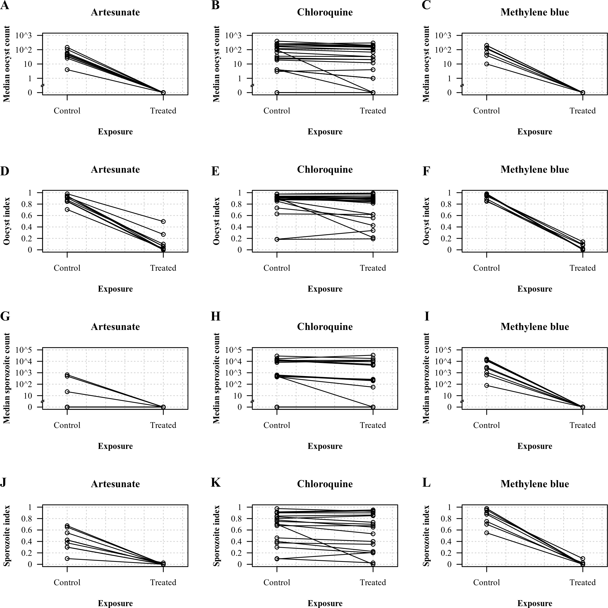
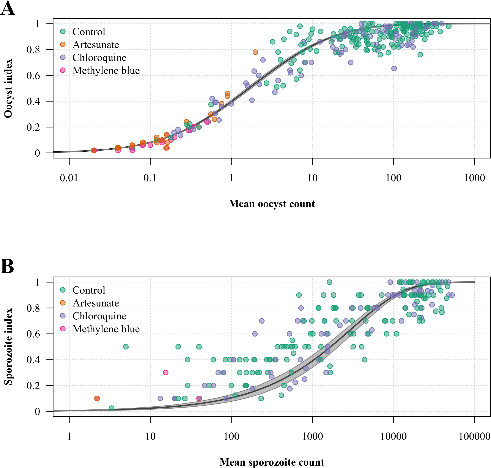

# transmission-blocking-plasmodium-vivax

This repository provides data and code for the analysis of a laboratory study carried out to assess the transmission-blocking activity of antimalarial drugs (artesunate, chloroquine and methylene blue) against _Plasmodium vivax_ gametoyctes.

This analysis was carried out by Dr. Victor Chaumeau* under the supervision of Dr. James A. Waston, who developed the analysis framework and wrote the Stan code for the Bayesian multi-level model used in this study, based on the original work of Medeley _et al._

_Medley GF, Sinden RE, Fleck S, Billingsley PF, Tirawanchai N, Rodriguez MH. Heterogeneity in patterns of malarial oocyst infections in the mosquito vector. Parasitology. 1993 Jun;106 ( Pt 5):441–9._

\*For correspondence: victor@shoklo-unit.com

The preprint with the results (under review at elife): __to be completed__

## Data

The data are provided in the folder Rdata.

## Main result

The results in the paper are generated in the Markdown _analysis.Rmd_.

Chloroquine exhibited little transmission-blocking activity on _P. vivax gametocytes_, despite the high concentrations used (__Figure 1__). Of all dissected mosquitos in the chloroquine spiked samples, 2974/4036 (74%) carried oocysts in the treated replicates compared with 3299/4026 (82%) in the controls (relative risk, RR: 0.85 [95% confidence interval, CI: 0.70 to 0.98], log10[p-value] = -24.73), and 701/1177 (60%) carried sporozoites in the treated replicates compared with 785/1228 (64%) in the controls (RR: 0.89 [95%CI: 0.86 to 0.92], log10[p-value] = -2.3). In contrast, artesunate and methylene blue almost completely interrupted gametocyte transmission. For artesunate, only 207/1798 (12%) of the mosquitos carried oocysts in the treated replicates compared with 1591/1797 (89%) in the controls (RR: 0.04 [95%CI: 0.0004 to 0.94], log10[p-value] = -258.52) and 1/360 (0.3%) dissected mosquitos carried sporozoites in the treated replicates versus 152/360 (42%) in the controls (RR: 0.0078% [95%CI: 0.0002 to 0.31], log10[p-value] = -8.14); for methylene blue, only 76/1599 (5%) carried oocysts in the treated replicates versus 1470/1592 (92%) in the controls (RR: 0.017 [95%CI: 0.0001 to 0.93], log10[p-value] = -255.89) and only 5/320 (1.6%) carried sporozoites in the treated replicates versus 267/320 (83%) in the controls (RR: 0.0045 [95%CI: 0.00002 to 0.6], log10[p-value] = -32.12).

__Figure 1. Effects of chloroquine, methylene blue and artesunate on the development of _P. vivax_ in _An. dirus_.__ (A-C) Median oocyst count; (D-F) oocyst index; (G-I) median sporozoite count; (J-L) sporozoite index. Values in the control and treated replicates were collated by assay run.

We estimated the drug effects under a Bayesian multi-level model (mixed effects) whereby the count data were modelled as negative binomial with the dispersion parameter as a parametric function of the mean count. The model parameterized the drug effect as a reduction in the mean number of parasites per mosquito, accounting for variability across blood samples and mosquito batches. Under this model, gametocyte exposure to chloroquine decreased the mean oocyst count 1.40-fold [95% credible interval, CrI: 1.20 to 1.65-fold] (from 100 to 69 oocysts per mosquito in the controls and treated replicates, respectively) and the mean sporozoite count 1.34-fold [95%CrI: 1.12 to 1.66-fold] (from 14,414 to 11,132 sporozoites per mosquito in the controls and treated replicates, respectively). The corresponding figures for artesunate and methylene blue were a 469-fold reduction [95%CrI: 345 to 650-fold] (from 60 to 0.22 oocysts per mosquito in the controls and treated replicates, respectively) and a 1438-fold reduction [95%CrI: 970 to 2064-fold] (from 107 to 0.08 oocysts per mosquito in the controls and treated replicates, respectively) in oocyst count respectively and a 148-fold [95%CrI: 61 to 470-fold] (from 1303 to 0.1 sporozoites per mosquito in the controls and treated replicates, respectively) and a 536-fold [95%CrI: 246 to 1311-fold] (from 13914 to 1.8 sporozoites per mosquito in the controls and treated replicates, respectively) reduction in sporozoite count, respectively. The model fitted the data well as shown by the inferred relationship between the mean parasite count and proportion of Plasmodium-infected specimens in mosquito samples (Figure 2).

__Figure 2. Relationship between the mean parasite count and proportion of _Plasmodium_-infected mosquitos in the assay.__ (A) Paired mean number of oocysts per mosquito and oocyst index determined in the control and treated replicates; (B) paired mean number of sporozoites per mosquito and sporozoite index. The black line and shaded area show the model-fitted relationship plotted using a0 and a1 estimates given by the model output and the corresponding 95% credible interval, respectively.

## Modelling work

The model written in stan is in the folder _code_.
