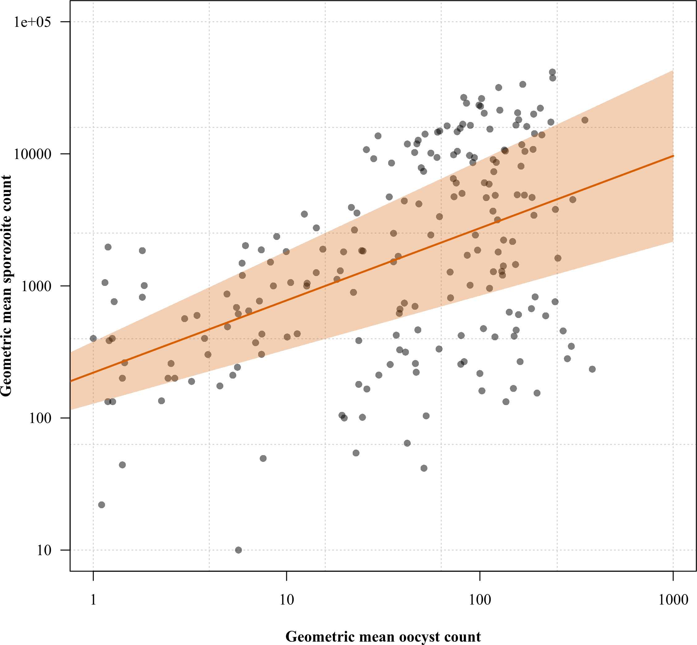

# Foreword

This analysis was carried out by Dr. Victor Chaumeau* under the supervision of Dr. James A. Waston, who wrote the Stan code for the Bayesian multi-level model used in this study.

\* For correspondence: victor@shoklo-unit.com


# Session information


```
## R version 4.2.2 Patched (2022-11-10 r83330)
## Platform: x86_64-pc-linux-gnu (64-bit)
## Running under: Debian GNU/Linux 12 (bookworm)
## 
## Matrix products: default
## BLAS:   /usr/lib/x86_64-linux-gnu/atlas/libblas.so.3.10.3
## LAPACK: /usr/lib/x86_64-linux-gnu/atlas/liblapack.so.3.10.3
## 
## locale:
##  [1] LC_CTYPE=en_US.UTF-8       LC_NUMERIC=C              
##  [3] LC_TIME=en_US.UTF-8        LC_COLLATE=en_US.UTF-8    
##  [5] LC_MONETARY=en_US.UTF-8    LC_MESSAGES=en_US.UTF-8   
##  [7] LC_PAPER=en_US.UTF-8       LC_NAME=C                 
##  [9] LC_ADDRESS=C               LC_TELEPHONE=C            
## [11] LC_MEASUREMENT=en_US.UTF-8 LC_IDENTIFICATION=C       
## 
## attached base packages:
## [1] stats     graphics  grDevices utils     datasets  methods   base     
## 
## other attached packages:
##  [1] lme4_1.1-35.1      Matrix_1.6-5       forcats_1.0.0      stringr_1.5.1     
##  [5] dplyr_1.1.4        purrr_1.0.2        readr_2.1.5        tibble_3.2.1      
##  [9] ggplot2_3.4.4      tidyverse_1.3.2    EnvStats_2.8.1     scales_1.3.0      
## [13] plotrix_3.8-2      rstan_2.32.5       StanHeaders_2.32.5 tidyr_1.3.1       
## [17] extrafont_0.19     RColorBrewer_1.1-3
## 
## loaded via a namespace (and not attached):
##  [1] httr_1.4.5          splines_4.2.2       jsonlite_1.8.8     
##  [4] QuickJSR_1.1.3      modelr_0.1.11       RcppParallel_5.1.7 
##  [7] stats4_4.2.2        googlesheets4_1.0.1 cellranger_1.1.0   
## [10] yaml_2.3.8          lattice_0.22-5      Rttf2pt1_1.3.12    
## [13] pillar_1.9.0        backports_1.4.1     glue_1.7.0         
## [16] extrafontdb_1.0     digest_0.6.34       minqa_1.2.6        
## [19] rvest_1.0.3         colorspace_2.1-0    htmltools_0.5.7    
## [22] pkgconfig_2.0.3     broom_1.0.5         haven_2.5.4        
## [25] tzdb_0.4.0          timechange_0.3.0    googledrive_2.0.0  
## [28] generics_0.1.3      withr_3.0.0         cli_3.6.2          
## [31] magrittr_2.0.3      crayon_1.5.2        readxl_1.4.3       
## [34] evaluate_0.23       fs_1.6.3            fansi_1.0.6        
## [37] nlme_3.1-162        MASS_7.3-60.0.1     xml2_1.3.3         
## [40] pkgbuild_1.4.3      tools_4.2.2         loo_2.6.0          
## [43] hms_1.1.3           gargle_1.3.0        lifecycle_1.0.4    
## [46] matrixStats_1.2.0   V8_4.2.2            munsell_0.5.0      
## [49] reprex_2.1.0        compiler_4.2.2      rlang_1.1.3        
## [52] nloptr_2.0.3        grid_4.2.2          rstudioapi_0.15.0  
## [55] rmarkdown_2.25      boot_1.3-28.1       gtable_0.3.4       
## [58] codetools_0.2-19    inline_0.3.19       DBI_1.2.1          
## [61] curl_5.0.0          R6_2.5.1            gridExtra_2.3      
## [64] lubridate_1.9.3     knitr_1.45          fastmap_1.1.1      
## [67] utf8_1.2.4          stringi_1.8.3       parallel_4.2.2     
## [70] Rcpp_1.0.12         vctrs_0.6.5         dbplyr_2.4.0       
## [73] tidyselect_1.2.0    xfun_0.41
```


# Summary of assay runs


Table: Table 1. Summary of assay runs

|   | No. of blood samples| No. baseline batches| No. control batches| No. treated batches| No. dissected guts in baseline bacthes| No. dissected guts in control bacthes| No. dissected guts in treated bacthes| No. dissected pairs of salivary glands in baseline batches| No. dissected pairs of salivary glands in control batches| No. dissected pairs of salivary glands in treated batches|
|:--|--------------------:|--------------------:|-------------------:|-------------------:|--------------------------------------:|-------------------------------------:|-------------------------------------:|----------------------------------------------------------:|---------------------------------------------------------:|---------------------------------------------------------:|
|AS |                    9|                    9|                  36|                  36|                                    450|                                  1797|                                  1798|                                                         90|                                                       360|                                                       360|
|CQ |                   21|                   21|                  84|                  84|                                   1008|                                  4026|                                  4036|                                                        263|                                                      1228|                                                      1177|
|MB |                    8|                    8|                  32|                  32|                                    404|                                  1592|                                  1599|                                                         80|                                                       320|                                                       320|

38 vivax malaria patients took part in the study and provided a blood sample before receiving antimalarial drug regimen, 342 mosquito batches were fed on these samples and  20908 specimens were dissected for assessment of either oocyst or sporozoite count.

# Baseline characteristics of the samples


## Asexual parasitaemia


```r
quantile(dta$AsexualParasitaemia, probs = c(0.5, 0.25, 0.75))
```

```
##       50%       25%       75% 
## 13160.700  6980.831 27798.019
```

```r
aggregate(AsexualParasitaemia~Drug, FUN = quantile, probs = c(0.5,0.25,0.75), data = dta)
```

```
##   Drug AsexualParasitaemia.50% AsexualParasitaemia.25% AsexualParasitaemia.75%
## 1   AS                12108.60                 8257.90                16608.38
## 2   CQ                12740.00                 3610.45                21652.31
## 3   MB                17717.60                10116.38                28675.35
```


## Gametocytaemia


```r
quantile(dta$Gametocytaemia, probs = c(0.5,0.25,0.75))
```

```
##       50%       25%       75% 
## 1091.5500  473.2875 2009.2125
```

```r
aggregate(Gametocytaemia~Drug, FUN = quantile, probs = c(0.5,0.25,0.75), data = dta)
```

```
##   Drug Gametocytaemia.50% Gametocytaemia.25% Gametocytaemia.75%
## 1   AS            766.700            524.475           1350.250
## 2   CQ            897.750            195.000           1849.175
## 3   MB           1821.050           1308.666           4062.525
```


## Oocyst index


```r
quantile(dta_agg$`NbOocysts > 0`, probs = c(0.5,0.25,0.75))
```

```
##  50%  25%  75% 
## 0.96 0.84 0.98
```

```r
aggregate(`NbOocysts > 0`~Drug, FUN = quantile, probs = c(0.5,0.25,0.75), data = dta_agg)
```

```
##   Drug NbOocysts > 0.50% NbOocysts > 0.25% NbOocysts > 0.75%
## 1   AS         0.9800000         0.9400000         0.9800000
## 2   CQ         0.9591837         0.6800000         0.9800000
## 3   MB         0.9600000         0.9158824         0.9850000
```


## Oocyst count


```
##     50%     25%     75% 
##  63.750   4.125 124.875
```

```
##   Drug NbOocysts.50% NbOocysts.25% NbOocysts.75%
## 1   AS        95.000        48.500       127.000
## 2   CQ        18.500         2.000        92.000
## 3   MB       114.500        54.625       183.875
```


## Sporozoite index


```r
quantile(dta_agg$`NbSporozoites2 > 0`, probs = c(0.5,0.25,0.75))
```

```
##  50%  25%  75% 
## 0.70 0.35 0.90
```

```r
aggregate(`NbSporozoites2 > 0`~Drug, FUN = quantile, probs = c(0.5,0.25,0.75), data = dta_agg)
```

```
##   Drug NbSporozoites2 > 0.50% NbSporozoites2 > 0.25% NbSporozoites2 > 0.75%
## 1   AS                0.60000                0.10000                0.70000
## 2   CQ                0.65000                0.27500                0.85625
## 3   MB                0.95000                0.87500                1.00000
```


## Sporozoite count


```r
quantile(dta_agg$NbSporozoites2, probs = c(0.5,0.25,0.75))
```

```
##  50%  25%  75% 
##  211    5 4321
```

```r
aggregate(NbSporozoites2~Drug, FUN = quantile, probs = c(0.5,0.25,0.75), data = dta_agg)
```

```
##   Drug NbSporozoites2.50% NbSporozoites2.25% NbSporozoites2.75%
## 1   AS               33.0                0.0              211.0
## 2   CQ              122.0                2.5             2377.5
## 3   MB             4604.5             2402.5            10876.0
```


Overall, the median asexual parasitaemia was 13161 parasites /uL (inter-quartile range, IQR: 6981 to 27798) and the median gametocytaemia was 1092 gametocytes /uL (IQR: 473 to 2009). All blood samples but one were infectious to mosquitoes (97.4%, the sample that was not infectious during baseline became infectious after 24 hours of incubation). The median oocyst index (i.e., the proportion of mosquitoes harboring malaria oocysts) and oocyst count in mosquito samples were 0.96 (IQR: 0.84 to 0.98) and 63.8 oocysts per mosquito (IQR: 4.1 to 124.9). The corresponding figures for the sporozoite stage were 0.7 (IQR: 0.35 to 0.9) and 211 sporozoites per mosquito (IQR: 5 to 4321).

## Evolution of parasite count during incubation ex vivo


The median ratio of the median parasite count in the controls to the median parasite count at baseline was 0.93 (IQR: 0.51 to 3.68) and 0.9 (IQR: 0.01 to 6.56) for the oocyst and sporozoite stage, respectively.

<!-- --> 


# Prevalence estimates

<!-- --> 

# Drug effects on parasite count and parasite index


Chloroquine exhibited little transmission-blocking activity on P. vivax gametocyte transmission, despite the high concentrations used (Figure 1). Of all dissected mosquitoes in the chloroquine spiked samples, 2974/4036 (73.69%) carried oocysts in the treated replicates compared with 3299/4026 (81.94%) in the controls (relative risk, RR: 0.85 [95%CI 0.7 to 0.98], log10[p-value] = -24.73), and 701/1177 (59.56%) carried sporozoites in the treated replicates compared with 785/1228 (63.93%) in the controls (RR: 0.89 [95%CI 0.86 to 0.92], log10[p-value] = -2.3). In contrast, artesunate and methylene blue almost completely interrupted gametocyte transmission. For artesunate, only 207/1798 (11.51%) of the mosquitoes carried oocysts in the treated replicates compared with 1591/1797 (88.54%) in the controls (RR: 0.04 [95%CI 4e-04 to 0.94], log10[p-value] = -258.52) and 1/360 (0.28%) dissected mosquitoes carried sporozoites in the treated replicates versus 152/360 (42.22%) in the controls (RR: 0.0078 [95%CI 2e-04 to 0.31], log10[p-value] = -8.14); for methylene blue, only 76/1599 (4.75%) carried oocysts in the treated replicates versus 1470/1592 (92.34%) in the controls (RR: 0.017 [95%CI 1e-04 to 0.93], log10[p-value] = -255.89) and only 5/320 (1.56%) carried sporozoites in the treated replicates versus 267/320 (83.44%) in the controls (RR: 0.0045 [95%CI 2e-05 to 0.6], log10[p-value] = -32.12).

<!-- --> 

# Look at model coefficient etimates

As observed previously, there was considerable heterogeneity in the count data across mosquitos and a considerable variability in the count data across blood samples and experimental batches. To account for this heterogeneity and variability, we estimated the drug effects under a Bayesian hierarchical model (mixed effects) whereby the count data are modelled as negative binomial with the dispersion parameter as a parametric function of the mean count (Table 2; see Methods) (20). In contrast to the previous data describing proportions of mosquitos with parasites, the model parameterizes the drug effect as a reduction in the mean number of parasites per mosquito, accounting for variability across blood samples and mosquito batches.


Table: Parameter estimates given by the output of transmission-blocking activity model fitted to oocyst and sporozoite data

|                       | Oocyst_Median|Oocyst_CI        | Sporozoite_Median|Sporozoite_CI    |
|:----------------------|-------------:|:----------------|-----------------:|:----------------|
|mu_population          |       44.6000|31.3 to 63.7     |         4906.6000|2875 to 8158.8   |
|sigma_patient          |        0.9200|0.74 to 1.15     |            1.2200|0.98 to 1.54     |
|sigma_batch            |        0.4600|0.41 to 0.53     |            0.3100|0.23 to 0.41     |
|a0                     |        0.4091|0.3719 to 0.4469 |            0.0007|4e-04 to 0.0012  |
|a1                     |        0.1865|0.1637 to 0.2099 |            0.6103|0.5556 to 0.6826 |
|artesunate_effect      |        0.0021|0.0015 to 0.0029 |            0.0068|0.0021 to 0.0165 |
|chloroquine_effect     |        0.7142|0.606 to 0.8359  |            0.7444|0.6032 to 0.8951 |
|methylene_blue_effect  |        0.0007|5e-04 to 0.001   |            0.0019|8e-04 to 0.0041  |
|baseline_oocyst_count  |        1.8000|1.2 to 2.5       |            1.2000|0.7 to 2         |
|baseline_parasitemia   |        1.1000|0.6 to 2.1       |            1.2000|0.5 to 3         |
|baseline_gametocytemia |        6.5000|3 to 13.4        |            3.6000|1.2 to 9.2       |
|wash                   |        0.8000|0.4 to 1.7       |            0.3000|0.1 to 0.6       |


Under the model, gametocyte exposure to chloroquine decreased the mean oocyst count 1.4-fold [95% credible interval [CrI]: 1.65 to 1.2-fold] (from 100.33 to 69.44 oocysts per mosquito in the controls and treated replicates, respectively) and the mean sporozoite count 1.34-fold [95%CrI 1.66 to 1.12-fold] (from 14414.5 to 11131.9 sporozoites per mosquito in the controls and treated replicates, respectively). The corresponding figures for artesunate and methylene blue were a 469.42-fold reduction [95%CrI 650.45 to 344.73-fold] (from 60.56 to 0.22 oocysts per mosquito in the controls and treated replicates, respectively) and a 1437.88-fold reduction [95%CI 2063.86 to 969.55-fold] (from 107.25 to 0.08 oocysts per mosquito in the controls and treated replicates, respectively) in oocyst count respectively and a 147.77-fold [95%CrI 469.56 to 60.64-fold] (from 1303.3 to 0.1 sporozoites per mosquito in the controls and treated replicates, respectively) and a 536.1-fold [95%CrI 1310.51 to 245.99-fold] (from 13914.5 to 1.8 sporozoites per mosquito in the controls and treated replicates, respectively) reduction in sporozoite count, respectively.


To consider baseline variations in blood meal infectiousness to mosquitoes across blood samples, the log10[oocyst count], log10[asexual parasitaemia] and log10[gametocytaemia] assessed on admission (i.e., on the collection day before the 24-hour incubation time with or without drug) were introduced as linear predictors of the mean parasite count in mosquito samples of the experimental replicates (i.e. after 24 hours of incubation with or without drug). A 10-fold increase in the mean oocyst count and gametocytaemia at baseline were respectively associated with a 1.76 [95%CI: 1.2 to 2.48] and a 6.47-fold increase [95%CI: 3.04 to 13.37] in the mean oocyst count in the experimental replicates;  there was no significant association between the mean oocyst count in experimental replicate and baseline asexual parasitaemia (model coefficient: 1.08 [95%CI 0.56 to 2.11]) or artesunate wash off (model coefficient: 0.84 [95%CI 0.41 to 1.71]).  A 10-fold increase in baseline gametocytaemia and artesunate wash off were respectively associated with a 3.56-fold increase [95%CI 1.21 to 9.2] and a 0.26-fold decrease [95%CI 0.1 to 0.61] in the mean sporozoite count in the experimental replicates;  there was no significant association between the mean sporozoite count in the experimental replicate and mean oocyst count (model coefficient: 1.21 [95%CI 0.72 to 1.96]) or asexual parasitaemia (model coefficient: 1.22 [95%CI 0.48 to 2.96]) at baseline.

# Assay variability

## Inter-experiment variability

<!-- --> 

These are the figures for inter-experiment variability (in fold-variation in the mean parasite count across blood samples):


```r
quantile(my_table$median.oocyst)
```

```
##        0%       25%       50%       75%      100% 
## 0.1569302 0.6182925 1.0669434 2.0812507 4.0001822
```

```r
quantile(my_table$median.sporozoite, na.rm = T)
```

```
##        0%       25%       50%       75%      100% 
## 0.1215025 0.4695308 1.3234454 2.3978970 6.8286956
```


## Intra-experiment variability

<!-- --> 

These are the figures for intra-experiment variability (in fold-variation in the mean parasite count accross technical replicates):


```r
quantile(my_table$median.oocyst)
```

```
##          0%         25%         50%         75%        100% 
## 0.005421552 0.768113629 1.001994206 1.298951808 4.045166536
```

```r
quantile(my_table$median.sporozoite, na.rm = T)
```

```
##        0%       25%       50%       75%      100% 
## 0.6208217 0.9386475 0.9875390 1.0514436 1.8824427
```

# Correlation between oocyst and sporozoite count


```
## 
## Call:
## lm(formula = yval ~ xval)
## 
## Residuals:
##      Min       1Q   Median       3Q      Max 
## -1.75436 -0.41638  0.08999  0.52068  1.03513 
## 
## Coefficients:
##             Estimate Std. Error t value Pr(>|t|)    
## (Intercept)  2.34347    0.11931  19.642  < 2e-16 ***
## xval         0.54698    0.07005   7.809 2.98e-13 ***
## ---
## Signif. codes:  0 '***' 0.001 '**' 0.01 '*' 0.05 '.' 0.1 ' ' 1
## 
## Residual standard error: 0.6681 on 204 degrees of freedom
## Multiple R-squared:  0.2301,	Adjusted R-squared:  0.2263 
## F-statistic: 60.98 on 1 and 204 DF,  p-value: 2.979e-13
```

<!-- --> 

The fit line equation is y = 0.5469815*x + 2.3434715.

# Model assesment

## Traceplots

### Oocyst stage

<!-- --> 

### Sporozoite stage

<!-- --> 


## Comparison of priors and posteriors

### Oocyst stage

<!-- --> 

### Sporozoite stage

<!-- --> 
